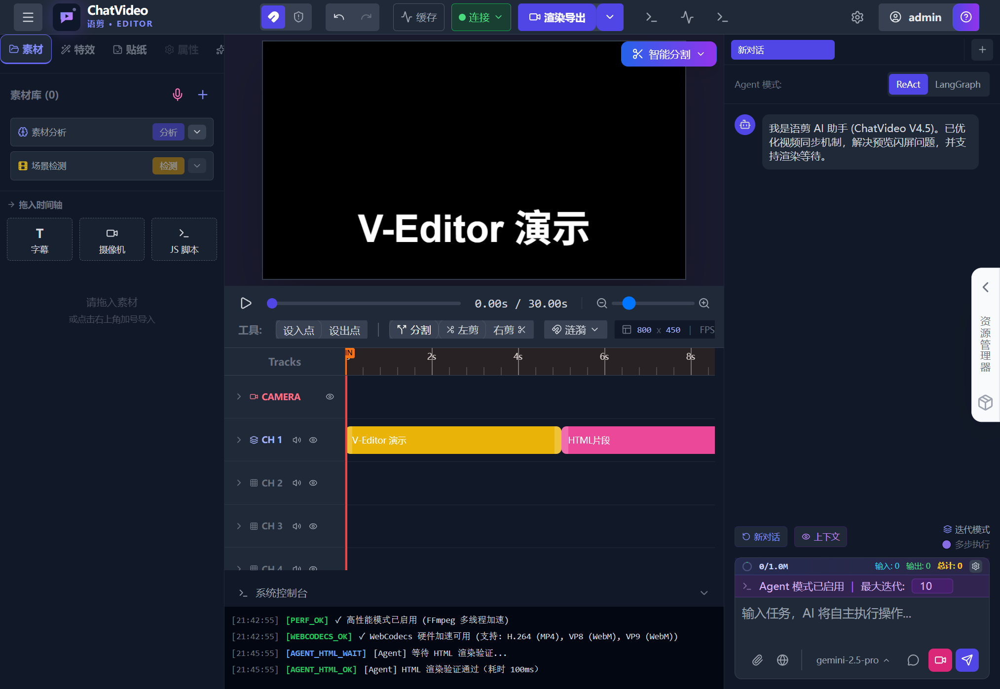
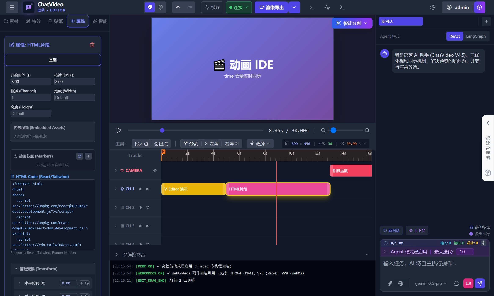
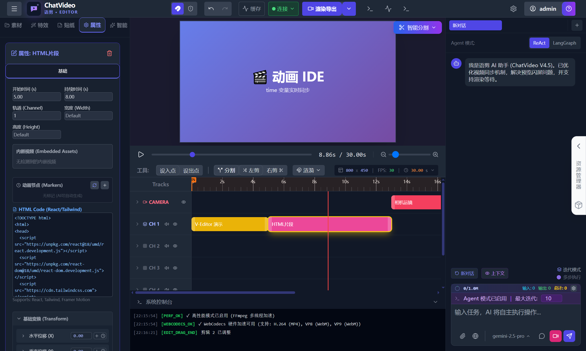

# V-Editor

<p align="center">
  
  
  
  
</p>

**V-Editor** is an AI-powered online video editor that makes AI your creative editing director.

🌐 **Live Demo**: [web-ai-media-editor.cn](https://web-ai-media-editor.cn) | [web-ai-media-editor.xyz](https://web-ai-media-editor.xyz)

<p align="center">
  
</p>

---

## ✨ Key Features

### 🤖 AI Agent System

V-Editor comes with a complete AI Agent system, not just simple tool calls:

- **Multi-stage Workflow** - Agent automatically plans, executes, verifies, and fixes
- **Intelligent Decision Making** - Automatically decides next steps based on execution results
- **Visual Verification** - Automatically captures screenshots after operations to verify effects
- **Error Recovery** - Automatically attempts fixes when encountering issues instead of just reporting errors
- **Context Compression** - Long conversations are automatically compressed to maintain response speed
- **Multi-model Support** - Supports Gemini, Claude, GPT and other mainstream models

<p align="center">
  
</p>

### 🎬 Animation IDE (Original)

V-Editor includes a purpose-built IDE for video animations:

- **Time Synchronization** - The `time` variable in code syncs with the timeline in real-time
- **Instant Preview** - See effects immediately in the preview window after code changes
- **Drag-to-Debug** - Drag the timeline and animations follow along
- **React Components** - Write animations in React with Tailwind CSS and Framer Motion support
- **Embedded Video Detection** - Automatically identifies video resources in HTML
- **Animation Node Markers** - AI can automatically generate animation keyframe markers

<p align="center">
  
</p>

### 🎥 TransNet V2 Scene Detection

Built-in deep learning scene detection that automatically identifies shot transitions in videos:

- **One-click Detection** - Automatically analyzes videos and marks all scene transition points
- **Adjustable Threshold** - Adjust detection sensitivity based on video type
- **Auto Split** - One-click to add detected scenes to the timeline
- **Short Scene Merging** - Intelligently merges overly short scene segments

### 🔍 Media Scraper (V-Editor Box)

Desktop version includes built-in media scraper service for one-click search and download:

- **Free Videos** - Mixkit high-quality royalty-free videos
- **Free Images** - Pexels professional photography
- **Free Music** - Incompetech (Kevin MacLeod) + Mixkit music
- **Video Download** - yt-dlp supports YouTube, Bilibili, TikTok and 1000+ platforms

### 🔗 MCP Protocol Support

Seamlessly integrates with AI IDEs like Kiro, Cursor, and Claude Desktop:

- Directly manipulate video timeline from AI IDE
- AI can view timeline state and capture frames
- Enables seamless collaboration between code and video editing

### 🎯 Professional Editing Capabilities

- **Multi-track Timeline** - Supports unlimited tracks with layer stacking
- **Keyframe Animation** - Animate opacity, position, scale and other properties
- **Transition Effects** - Fade, slide, wipe (ported from Remotion)
- **3D Camera Movements** - Shake, zoom, Hitchcock, orbit
- **Semantic Search** - Search media with natural language (CLIP model)
- **Speech-to-Subtitles** - Whisper local transcription with word-level timestamps
- **One-click Speech Error Editing** - Automatically detect and remove stutters, repetitions, filler words

---

## 🖥️ Running Modes

V-Editor can run in two environments:

| Environment | Description | Media Scraper |
|-------------|-------------|---------------|
| **Web Version** | Open directly in browser | ❌ |
| **V-Editor Box** | Electron desktop client | ✅ Built-in |

### Web Version

Access the deployed URL directly or start a local development server. All editing features are available, but without the media scraper.

### V-Editor Box (This Project)

Electron desktop client with built-in media scraper service:
- Mixkit free videos/music
- Pexels free images
- yt-dlp video download (supports 1000+ platforms)

---

## 🎮 Usage

### Basic Operations

1. **Import Media** - Drag and drop videos/images/audio to the media library
2. **Add to Timeline** - Drag media to the timeline
3. **AI Chat** - Describe desired effects in natural language in the chat box
4. **Preview & Export** - Real-time preview and export final product

### Keyboard Shortcuts

| Shortcut | Function |
|----------|----------|
| `Space` | Play/Pause |
| `V` | Toggle clip visibility |
| `Delete` | Delete selected clip |
| `Ctrl+Z` | Undo |
| `Ctrl+Shift+Z` | Redo |

### AI Assistant Examples

Type in the chat box:
- "Add a 5-second title that says 'Welcome'"
- "Add a fade in/out effect to the video"
- "Trim this video to 10 seconds"
- "Add a left-to-right slide transition"
- "Set to TikTok vertical format"

---

## 🛠️ AI Tools List

### Editing Tools

| Tool | Function |
|------|----------|
| `add_element` | Add media/text/HTML animation/camera movement/transitions with dependency chains and TTS voiceover support |
| `edit_clip` | Move/trim/split/delete/copy clips |
| `set_clip_property` | Set properties or keyframe animations, supports batch mode and transition addition |
| `replace_in_html_clip` | Smart HTML code modification (4-layer matching strategy, tolerates whitespace differences) |
| `set_project_config` | Set resolution/frame rate/duration |
| `batch_edit` | Batch operations/ripple editing |
| `apply_timeline_edits` | Apply complete timeline JSON at once |

### Query Tools

| Tool | Function |
|------|----------|
| `inspect_timeline` | Query timeline state/clip details/HTML code (supports line number ranges) |
| `inspect_html_elements` | Query HTML element coordinates and code locations |
| `analyze_asset` | Analyze media details (duration/resolution/frame rate) |
| `search_assets_semantic` | CLIP semantic search for media (natural language descriptions) |
| `script_read` | Read video script task list |

### Verification Tools

| Tool | Function |
|------|----------|
| `capture_preview` | Capture timeline frames (single/multiple) |
| `capture_asset_frame` | Capture media frames/Filmstrip thumbnails |

### Media Analysis Tools

| Tool | Function |
|------|----------|
| `detect_video_scenes` | TransNet V2 scene detection |
| `transcribe_audio` | Groq Whisper speech-to-text |
| `auto_cut_speech_errors` | One-click speech error editing (transcribe→analyze→approval panel) |

### Search Tools

| Tool | Function |
|------|----------|
| `web_search` | DuckDuckGo web search (text/images) |
| `search_online_images` | FreeImageDomain online image search (free, no API key required) |

### Media Scraper Tools (V-Editor Box Only)

| Tool | Function |
|------|----------|
| `search_media` | Unified media search (Mixkit videos/music, Pexels images) |
| `download_stock_media` | Download media to local storage |
| `download_video_from_url` | yt-dlp download (YouTube/Bilibili/TikTok and 1000+ platforms) |

### Task Control Tools

| Tool | Function |
|------|----------|
| `proceed_to_execute` | Planning complete, enter execution phase |
| `task_complete` | Mark task as complete |
| `report_issue` | Report issue, trigger fix workflow |
| `ask_user` | Ask user a question and wait for response |
| `script_write` | Write/update video script task list |

---

## 🔗 MCP Integration Configuration

V-Editor connects to AI IDEs through MCP Server. Connection flow:

1. Configure MCP Server in your AI IDE
2. Open V-Editor webpage
3. Click the **MCP Connect button** on the webpage (auto-connect or manually enter address)

### One-click Installation (npx method)

Add to your MCP configuration file:

```json
{
  "mcpServers": {
    "editor": {
      "command": "npx",
      "args": ["-y", "web-ai-editor-mcp-server@latest"],
      "env": {
        "EDITOR_WS_PORT": "9528"
      }
    }
  }
}
```

### Configuration File Locations

| AI Tool | Configuration File Path |
|---------|------------------------|
| Kiro | `~/.kiro/settings/mcp.json` |
| Cursor | `~/.cursor/mcp.json` |
| Claude Desktop (Mac) | `~/Library/Application Support/Claude/claude_desktop_config.json` |
| Claude Desktop (Win) | `%APPDATA%\Claude\claude_desktop_config.json` |

### Connection Steps

1. After adding the above configuration, restart your AI tool
2. Open [web-ai-media-editor.cn](https://web-ai-media-editor.cn)
3. Click the **MCP** button in the top right corner of the webpage
4. Select "Auto Connect" or manually enter `ws://localhost:9528`
5. Once connected, AI can control the editor ✅

---

## 🚀 Deployment & Development

### Web Version Deployment

```bash
# Install dependencies
npm install

# Development mode
npm run dev

# Build production version
npm run build
```

### V-Editor Box Development

```bash
cd v-editor-box

# Install dependencies
npm install

# Build scraper module
npm run build:scraper

# Start Electron app
npm start
```

### Build Desktop Installers

```bash
npm run build:win    # Windows
npm run build:mac    # macOS
npm run build:linux  # Linux
```

### Environment Variables

```env
# AI Service Configuration (Optional)
VITE_OPENAI_API_KEY=your_api_key
VITE_OPENAI_BASE_URL=https://api.openai.com/v1

# Groq Speech Transcription (Optional)
VITE_GROQ_API_KEY=your_groq_key
```

---

## 📁 Project Structure

```
v-editor/
├── src/                  # V-Editor frontend source code
│   ├── agentSystem.ts    # AI Agent system
│   ├── mcpBridge.ts      # MCP protocol bridge
│   └── App.tsx           # Main application
├── api/                  # Serverless API
└── v-editor-box/         # Electron desktop client
    ├── main.js           # Electron main process + HTTP service
    ├── scraper-src/      # Media scraper source code
    └── storage/          # Media storage directory
```

---

## 📄 License

MIT License
